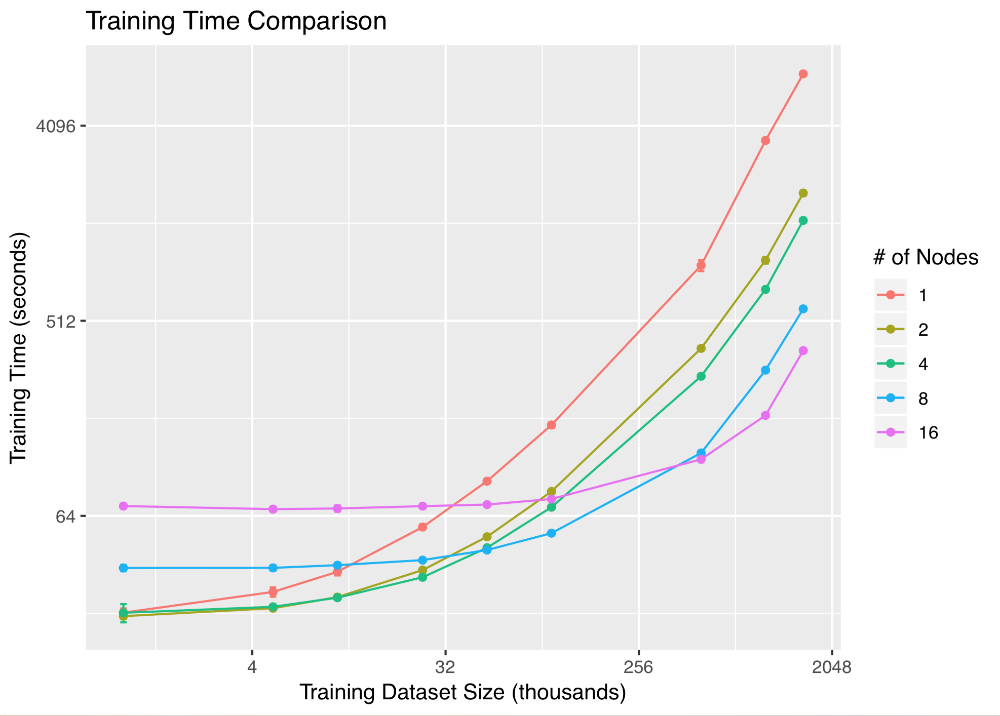

# Distributed-Deep-Learning

This library is the result of Robert K.L. Kennedy's summer 2018 internship.

This library is designed to leverage HPCC Systems and Google TensorFlow to provide HPCC a
distributed deep learning runtime. Current implementation is based off of the Parallel Stochastic Gradient Descent research paper by Zinkevich et al., a synchronous data parallel design.
It uses HPCC/ECL to provide the data parallelism and TensorFlow for the localized neural network optimization.

I used Keras on top of TensorFlow, for two main reasons. First, Keras reduces the required 
lines of code. Secondly, and perhaps most importantly, Keras can use different deep learning libraries
as a 'backend' (Theano, CNTK, TensorFlow) removing this work's dependency on TensorFlow.

## Performance

A sufficiently large data set is required to see a benefit from training a neural network using
more than one Thor node. What constitutes "sufficient" is highly dependent on the type data, 
neural network model size, the underlying system hardware, and the model architecture. However,
in general as the dataset sizes increase the increase in Thor nodes will significantly reduce training time.

General trends can be observed in Figure 1. Note that the X and Y scale is logarithmic.

# System Requirements

The examples in this project require the pyembed plugin and Python to be installed on every machine in the system. Python version 2.7 has been tested, but Python 3.x should work with little to no modifications. In addition, there are several python packages that are required for use, the main libraries (and any of their included dependencies) are:

 * TensorFlow (only cpu installation has been tested)
 * Keras
 * numpy
 * pandas
 * h5py 

A full list of python packages of the system the examples were tested on can be found in "python_modules.txt".

